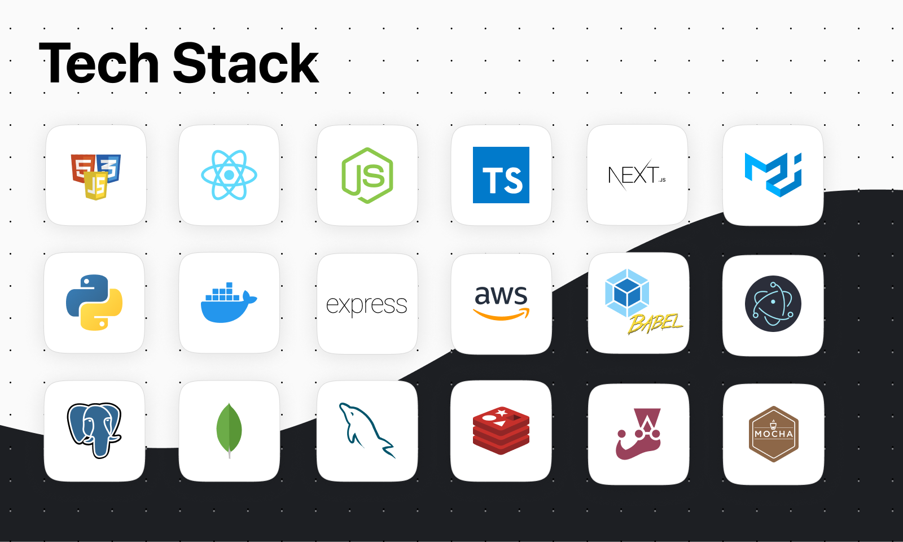

# Hi, I'm Keith 👋

- 👨‍💻 Software engineer with a background in philosophy and a passion for AI, HCI, and educational technology.
- 💻 Experienced in front-end development and interactive learning tools, with a growing focus on AI-driven applications in education, health tech, and science.
- 🔬 Strong analytical and problem-solving skills, informed by experience in scientific publishing and research collaboration. Currently deepening expertise in machine learning and human-computer interaction through graduate coursework.
- 👨‍🎤 I am a burning man participant with a background in academia and science: I love to talk about big ideas!

## This is what I'm good at

  

## Get in touch!
Please don't hesitate to reach out!

  
